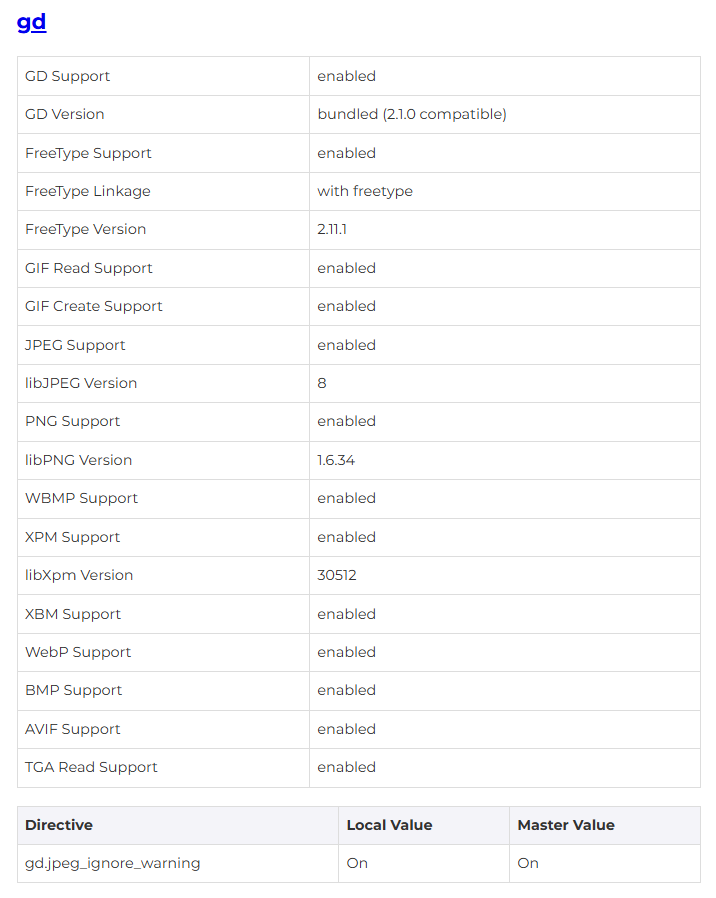

# Итоговое задание 49.6.1 (HW-04)

## Список задач
* Воспроизведите MVC-архитектуру согласно полученным знаниям, на примере сайта визитки
* Подключите пакет php-gd, прикрепить скрин о его подключении (phpinfo)
* Реализуйте в вашем приложении несколько статических страниц

## Реализованные задачи:
* Задание 1: Воспроизведена MVC-архитектура согласно полученным знаниям, на примере сайта визитки. **---> Был использован шаблонизатор TWIG <---**
* Задание 2: Подключён пакет php-gd

* Задание 3: Реализовано несколько статических страниц (О нас, Контакты), а также 2 страницы, которые выводят данные (Портфолио, Партнеры)